<!--
README.md — GitHub Profile of Mochamad Rizal Fauzan (rizalfanex)

Notes:
- assets/header.svg, assets/divider.svg, and assets/footer.svg are local animated SVGs (no external fetch needed).
- The contribution snake is generated by .github/workflows/snake.yml into the `output` branch (light + dark variants).
- Stats cards use safe configurations (no count_private / include_all_commits) to avoid API fetch failures.
-->

<div align="center">

<!-- ⚡ Animated Cyberpunk Header -->


<!-- ⌨️ Typing Intro -->
<a href="https://github.com/rizalfanex">
  
</a>

<br />

<!-- 📈 Live Counters -->


<br /><br />

<!-- 🔗 Socials -->
<a href="https://www.linkedin.com/in/rizalfauzan2002/">
  
</a>
<a href="mailto:rizalfauzan2002@gmail.com">
  
</a>
<a href="https://scholar.google.com/citations?user=wfTpQXgAAAAJ&hl">
  
</a>
<a href="https://orcid.org/0009-0009-5291-5513">
  
</a>

</div>


## 🧬 whoami

```typescript
const rizal = {
  name: "Mochamad Rizal Fauzan",
  role: ["AI Engineer", "Computer Vision Researcher", "Software Developer"],
  location: "Indonesia 🇮🇩",

  focus: {
    research:    ["Lightweight Deep Learning", "Knowledge Distillation", "RGB-T Perception", "Person ReID"],
    engineering: ["LLM & RAG Systems", "Edge AI Deployment", "Industrial IoT", "Full-Stack AI Apps"],
  },

  mission: "Build intelligent systems that are accurate, efficient, explainable — and actually useful",
  currentlyBuilding: "RAG-based expert assistants + lightweight vision models for the edge",
  funFact: "I turn research papers into running systems before the coffee gets cold ☕",
};
```

I work at the intersection of **deep learning, computer vision, embedded systems, IoT, LLMs, and retrieval-augmented generation** — transforming ideas into working systems: from model design and experimental validation, all the way to deployment, documentation, and reproducible engineering workflows.

<p align="center">
  <b>AI Research</b> · <b>Computer Vision</b> · <b>Embedded AI</b> · <b>Industrial IoT</b> · <b>LLM/RAG Systems</b> · <b>Software Engineering</b>
</p>


## 🔬 Research Interests

<table>
<tr>
<td width="50%" valign="top">

### 🧠 AI & Deep Learning
- Lightweight neural networks
- Knowledge distillation
- Model compression & edge deployment
- Robust AI under real-world constraints
- Evaluation, benchmarking & reproducibility

</td>
<td width="50%" valign="top">

### 👁️ Computer Vision & Perception
- Object detection & tracking
- Person re-identification
- Multispectral RGB-T perception
- Thermal & infrared image analysis
- Super-resolution for low-quality visual data

</td>
</tr>
<tr>
<td width="50%" valign="top">

### 🤖 LLM, RAG & Industrial AI
- Retrieval-augmented generation
- Domain-specific AI assistants
- Local/offline LLM deployment
- Knowledge base construction
- Evidence-grounded reasoning systems

</td>
<td width="50%" valign="top">

### ⚙️ Embedded Systems, IoT & Software
- Edge AI systems
- Sensor-based automation
- Real-time monitoring
- Microcontroller-based control systems
- Full-stack AI application development

</td>
</tr>
</table>


## 🧰 Tech Arsenal

<div align="center">

### Core Stack

<a href="https://skillicons.dev">
  
</a>

### AI / ML / Vision Specialties


### LLM / RAG / Vector Search


### Embedded & IoT


</div>


## 🚀 Featured Projects

<table>
<tr>
<td width="50%" valign="top">

### ⚡ Lightweight CNN Benchmarking
A reproducible benchmark comparing lightweight CNN architectures for image classification under unified training conditions.

`PyTorch` `CIFAR-100` `Lightweight CNN` `Benchmarking` `Edge AI`

<a href="https://github.com/rizalfanex/lightweight-cnn-benchmark">
  
</a>

</td>
<td width="50%" valign="top">

### 🧠 KD Hyperparameter Sensitivity
Research-grade analysis of vanilla knowledge distillation, temperature scaling, and loss balancing in compact CNNs on CIFAR-100.

`Knowledge Distillation` `ResNet-50` `MobileNetV2` `ShuffleNetV2`

<a href="https://github.com/rizalfanex/kd-hyperparameter-sensitivity-cifar100">
  
</a>

</td>
</tr>
<tr>
<td width="50%" valign="top">

### 🎓 Skripsiku
A full-stack AI academic writing assistant designed for Indonesian students, researchers, and journal authors.

`FastAPI` `Next.js` `Docker` `Kimi K2` `Academic Writing AI`

<a href="https://github.com/rizalfanex/skripsiku">
  
</a>

</td>
<td width="50%" valign="top">

### 🎥 Spatio-Temporal Bayesian ReID
Person re-identification combining deep visual embeddings with camera transition priors, temporal priors, and Bayesian re-ranking.

`Person ReID` `ResNet50` `Bayesian Re-ranking` `Market-1501`

<a href="https://github.com/rizalfanex/spatiotemporal-bayesian-reid">
  
</a>

</td>
</tr>
<tr>
<td width="50%" valign="top">

### 📊 Unfollow Insight
A responsive web tool for analyzing Instagram followers/following data and identifying non-followback accounts from exported JSON files.

`HTML` `JavaScript` `TailwindCSS` `DataTables` `GitHub Pages`

<a href="https://github.com/rizalfanex/unfollow-insight">
  
</a>
<a href="https://rizalfanex.github.io/unfollow-insight/">
  
</a>

</td>
<td width="50%" valign="top">

### ✅ Chat2Task
A Telegram-first task copilot that turns messy chat messages into structured reminders, summaries, drafts, and task actions.

`FastAPI` `Telegram Bot` `LLM` `Scheduling` `Task Automation`

<a href="https://github.com/rizalfanex/Chat2Task">
  
</a>

</td>
</tr>
</table>

<div align="center">

<a href="https://github.com/rizalfanex/lightweight-cnn-benchmark">
  
</a>
<a href="https://github.com/rizalfanex/kd-hyperparameter-sensitivity-cifar100">
  
</a>
<a href="https://github.com/rizalfanex/skripsiku">
  
</a>
<a href="https://github.com/rizalfanex/spatiotemporal-bayesian-reid">
  
</a>

</div>


## 🎯 Current Focus

```text
┌──────────────────────────────────────────────────────────────────────────┐
│  Research      →  Robust AI · CV · lightweight deep learning · RGB-T     │
│  Engineering   →  LLM/RAG systems · local AI · industrial assistants     │
│  Development   →  Python backends · Dockerized AI · full-stack AI apps   │
│  Collaboration →  Research papers · open-source AI · applied industry AI │
└──────────────────────────────────────────────────────────────────────────┘
```

- 🛠️ Building reliable AI systems for real-world deployment
- 🪶 Designing lightweight and efficient computer vision models
- 📚 Developing RAG-based expert assistants for technical & industrial domains
- 🔁 Improving reproducibility, documentation & evaluation quality in AI research
- 📡 Exploring edge AI pipelines for embedded and IoT environments


## 📊 GitHub Analytics

<div align="center">


<br /><br />


<br /><br />


<br /><br />


<br />


</div>


## 🏆 Highlights

<div align="center">


</div>


## 🐍 Contribution Snake

<div align="center">

<picture>
  <source media="(prefers-color-scheme: dark)" srcset="https://raw.githubusercontent.com/rizalfanex/rizalfanex/output/github-contribution-grid-snake-dark.svg" />
  <source media="(prefers-color-scheme: light)" srcset="https://raw.githubusercontent.com/rizalfanex/rizalfanex/output/github-contribution-grid-snake.svg" />
  
</picture>

</div>


## 💬 Random Dev Wisdom

<div align="center">


</div>


## 🤝 Let's Collaborate

I'm open to meaningful collaboration in **AI research, computer vision, embedded AI, industrial IoT, LLM/RAG systems, technical writing, and applied software development** — especially projects that combine research depth with real-world engineering impact.

<div align="center">

<a href="mailto:rizalfauzan2002@gmail.com">
  
</a>
<a href="https://www.linkedin.com/in/rizalfauzan2002/">
  
</a>
<a href="https://scholar.google.com/citations?user=wfTpQXgAAAAJ&hl">
  
</a>

<br /><br />

### “Building intelligent systems that are not only accurate, but also practical, reliable, and useful.”


</div>
